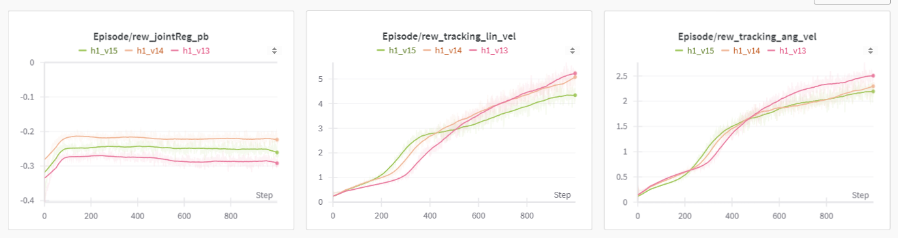
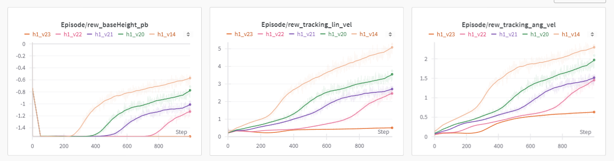
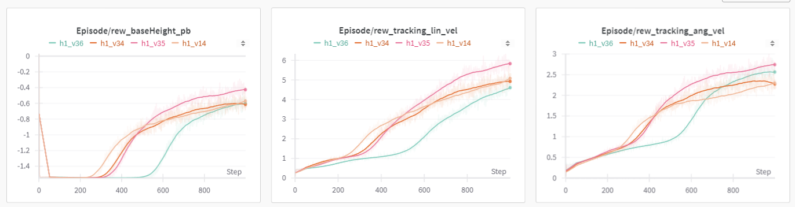
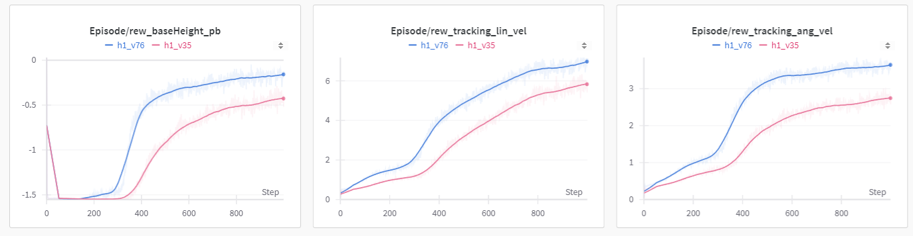
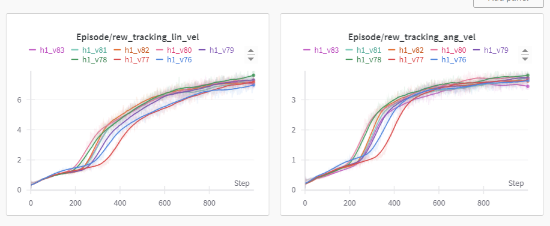
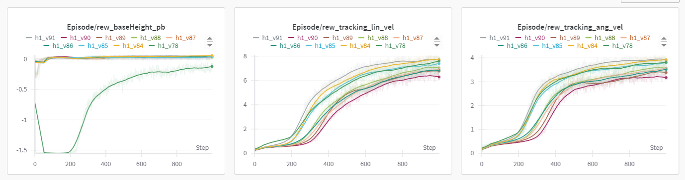

# Train Unitree H1 Robot with PBRS Algorithm Report

> Zhizhou Sha 2024.2.xx

Since the last report, where we enabled the H1 Robot to basically stand up and walk, I have proceeded with further improvements.

## 0 Current Best Results

h1_v84 is the best result I have reached so far.


## 1 Generalization Test 

The task description of PBRS can be summarized as follows: **Given a motion command** to the robot, which includes **forward velocity** (in the x-direction), lateral velocity (in the y-direction), and **angular velocity**, the ultimate training goal is to ensure that the robot's actual motion velocity matches the specified velocities in the command.

During training, the range for **forward velocity is [0, 4.5]**, **lateral velocity is [-0.75, 0.75]**, and **angular velocity is [-2, 2]**. In this section, we mainly observe the algorithm's generalization performance. Therefore, I will test the robot with the following command: **x_vel = 6, y_vel = 1.5, ang_vel = 4**.

From the mp4 below, **the model can generalize to out-of-distribution commands**. In the setting where x_vel = 6, the robot has a certain probability of falling, while in the other two out-of-distribution settings, the robot can almost follow the commands.

<center>
    <center style="width:60%;">
        <video controls>
          <source src="./videos/h1_v84_linx_6.mp4" type="video/mp4">
        </video>
        <p>h1_v84, x_vel = 6</p>
    </center>
    <center style="width:60%;">
        <video controls>
          <source src="./videos/h1_v84_liny_1.5.mp4" type="video/mp4">
        </video>
        <p>h1_v84, y_vel = 1.5</p>
    </center>
    <center style="width:60%;">
        <video controls>
          <source src="./videos/h1_v84_ang_4.mp4" type="video/mp4">
        </video>
        <p>h1_v84, ang_vel = 4</p>
    </center>
</center>


## 2 Implementation Details

### 2.1 Hip Roll Range

In the current experimental setting, **excessive freedom in the hip roll joint** results in **the robot stabilizing by crossing its legs**. Although this approach prevents the robot from falling, it is certainly not an optimal walking form. Therefore, it is necessary to **restrict the freedom of the hip roll joint** to avoid falling into this local optimum of leg crossing.

Therefore, the following experiments are conducted

| Exp Name | Description                             |
| -------- | --------------------------------------- |
| h1_v13   | Freedom of hip roll joint: [-0.78, 0.2] |
| h1_v14   | Freedom of hip roll joint: [-0.78, 0.1] |
| h1_v15   | Freedom of hip roll joint: [-0.78, 0.0] |

The training curves are as follows: 



From the training curve above, it can be observed that **reducing the freedom of the hip roll joint from 0.2 to 0.1**, though leading to a performance decrease in robot rotation (lower angular velocity reward), results in a **significant improvement in joint regularization pb**. This increase in the metric further indicates a more symmetrical movement of the robot's left and right legs, resulting in a more coordinated walking posture

**From now on, the baseline has changed from `h1_v13` to `h1_v14`**


### 2.2 Action Scale

<u>After adjusting the freedom of the hip roll joint, I found myself at a standstill, unsure of how to proceed with further optimization</u>. Upon reflection, I realized that the issue might lie in the torque applied to each joint. Consequently, I revisited the function for calculating torque

```python
torques = self.p_gains*(actions * self.cfg.control.action_scale /
        + self.default_dof_pos /
        - self.dof_pos) /
        - self.d_gains*self.dof_vel
```

I realize the `action_scale` might be a crucial factor to adjust. The `action_scale` reflects **how much the model's output actions will be amplified to affect changes in joint positions**. The model must have a preference on the output distribution of actions, and finding an appropriate `action_scale` such that **the model's output distribution aligns precisely with the desired joint changes** may potentially improve the robot's performance."

Firstly, I tried to increase the `action_scale`. However, <u>the results were not satisfactory</u>.

| Exp Name | Description        |
| -------- | ------------------ |
| h1_v14   | action scale: 1.0  |
| h1_v20   | action scale: 2.0  |
| h1_v21   | action scale: 3.0  |
| h1_v22   | action scale: 5.0  |
| h1_v23   | action scale: 10.0 |

From the training curve below, it is obvious that increasing `action_scale` has no benefit to the performance. 




However, things changed when I tried to decrease the `action_scale`

| Exp Name | Description       |
| -------- | ----------------- |
| h1_v14   | action scale: 1.0 |
| h1_v34   | action scale: 0.8 |
| h1_v35   | action scale: 0.5 |
| h1_v36   | action scale: 0.2 |

When `action_scale` reduces to 0.5, both the robot's <u>lin vel reward</u> and <u>ang vel reward</u> significantly increase. This indicates that the robot **is able to move more accurately according to the speeds and angular velocities specified in the instructions**.




From the following mp4, **some robots which would fall in `h1_v14 `are able to move at the instructed speed in `h1_v35`**. This further illustrates that action_scale = 0.5 is capable of better aligning the model output with changes in joint positions.

<center>
    <center style="width:60%;">
        <video controls>
          <source src="./videos/h1_v14.mp4" type="video/mp4">
        </video>
        <p>h1_v14 action_scale = 1.0</p>
    </center>
    <center style="width:60%;">
        <video controls>
          <source src="./videos/h1_v35.mp4" type="video/mp4">
        </video>
        <p>h1_v35 action_scale = 0.5</p>
    </center>
</center>


**From now on, the baseline has changed from `h1_v14` to `h1_v35`**


### 2.3 Efforts on Adjusting Stiffness and Damping of Some Joints

From the video in the previous section, it can be seen that the current walking pattern of the robot involves **maintaining balance by keeping the legs separated front and back, with movement forward initiated by ankle motion**. While this movement pattern ensures that the robot does not fall, it struggles to achieve rapid movements.

One solution to the aforementioned problem is to adjust the '**strength**' of each joint in the robot, specifically by tuning stiffness and damping. Therefore, I spent great efforts to adjust the joint strength in the ankle, knee, and hip regions. Unfortunately, **all my attempts did not yield positive results**. **Since this part of the experiment did not contribute to the final training scheme, I will skip over it here**.

From `h1_v40` to `h1_v62` are experiments conducted for this section. 


### 2.4 Default Joint Position Range

Continuing the study of torque calculation formulas, it was found that the `default_dof_pos` of all joints **is randomized in each epoch**. While the randomness isn't significant, **these noises can result in the model's inability to precisely control each joint**. Therefore, in this step, I removed the randomness of `default_dof_pos ` for all joints except the knee.

The following experiments are conducted to prove this concept.

| Exp Name | Description                    |
| -------- | ------------------------------ |
| h1_v35   | default_dof_pos randomized     |
| h1_v76   | default_dof_pos not randomized |

From the training curve below, `h1_v76` shows a significant performance improvement compared to `h1_v35`




From the mp4 below, it can be observed that `h1_v76` has a lower fall rate compared to `h1_v35`. Additionally, the **movements of the legs in `h1_v76` are more symmetrical**, and **walking patterns involving alternating foot force have begun to emerge**, which is exactly what we hope to see.


<center>
    <center style="width:60%;">
        <video controls>
          <source src="./videos/h1_v35.mp4" type="video/mp4">
        </video>
        <p>h1_v35 default_dof_pos randomized</p>
    </center>
    <center style="width:60%;">
        <video controls>
          <source src="./videos/h1_v76.mp4" type="video/mp4">
        </video>
        <p>h1_v76 default_dof_pos not randomized</p>
    </center>
</center>
**From now on, the baseline has changed from `h1_v35` to `h1_v76`**


### 2.5 Default Knee Position Range

The knee is a crucial joint in the robot. The ability to control the knee is key to its ability to walk effectively. Similar to the situation in Section 2, **there might be a bias in the model's output action at the knee joint**. By observing the torque calculation function, **it is possible to eliminate this bias by adjusting the default_dof_pos of the knee joint**.

Therefore, I conducted the following experiment."

| Exp Name | Description                         |
| -------- | ----------------------------------- |
| h1_v76   | default_dof_pos of knee: [0.6 ,0.7] |
| h1_v77   | default_dof_pos of knee: [0.8, 0.9] |
| h1_v78   | default_dof_pos of knee: [1.0, 1.1] |
| h1_v79   | default_dof_pos of knee: [1.2, 1.3] |
| h1_v80   | default_dof_pos of knee: [1.4, 1.5] |
| h1_v81   | default_dof_pos of knee: [1.6, 1.7] |
| h1_v82   | default_dof_pos of knee: [1.8, 1.9] |
| h1_v83   | default_dof_pos of knee: [2.0, 2.1] |



From the training curve above, it can be observed that `h1_v78` shows some improvement in performance compared to `h1_v76`. However, as seen in the mp4 below, `h1_v78` **not only improves in performance but also eliminates all instances of robot falls in the testing**. This confirms the existence of a certain bias in the model's output for the knee joint and demonstrates that this bias can be mitigated by adjusting the default_dof_pos of the knee joint."

<center>
    <center style="width:60%;">
        <video controls>
          <source src="./videos/h1_v76.mp4" type="video/mp4">
        </video>
        <p>h1_v76 default_dof_pos of knee: [0.6 ,0.7]</p>
    </center>
    <center style="width:60%;">
        <video controls>
          <source src="./videos/h1_v78.mp4" type="video/mp4">
        </video>
        <p>h1_v78 default_dof_pos of knee: [1.0, 1.1]</p>
    </center>
</center>


### 2.6 Orientation Termination Threshold

Lastly, recall that `orientation_termination` was temporarily ignored in previous experiments. This was because, at that time, my understanding of the algorithm was not mature enough, and `orientation_termination` **not only failed to guide the robot's walking but also hindered the learning process**. However, now we are reintroducing this condition, which may provide more guidance to the robot's walking posture.

The following experiments are conducted with the `orientation_termination`, **which means the robot will be reset if the component of body frame gravity exceeds 0.7 on the x-axis or y-axis**. In this context, we set the magnitude of gravity to be 0.98


| Exp Name | Description                         |
| -------- | ----------------------------------- |
| h1_v91   | default_dof_pos of knee: [0.6 ,0.7] |
| h1_v84   | default_dof_pos of knee: [0.8, 0.9] |
| h1_v85   | default_dof_pos of knee: [1.0, 1.1] |
| h1_v86   | default_dof_pos of knee: [1.2, 1.3] |
| h1_v87   | default_dof_pos of knee: [1.4, 1.5] |
| h1_v88   | default_dof_pos of knee: [1.6, 1.7] |
| h1_v89   | default_dof_pos of knee: [1.8, 1.9] |
| h1_v90   | default_dof_pos of knee: [2.0, 2.1] |


From the training curves below, adding `orientation_termination` can improve `base_height_pb` a lot, which means **robots are able to stand up while walking**.

 

And also, according to the training curve, we obtain our final result `h1_v84`. Testing mp4 is as follows:


<center>
    <center style="width:60%;">
        <video controls>
          <source src="./videos/h1_v84.mp4" type="video/mp4">
        </video>
        <p>h1_v84</p>
    </center>
</center>